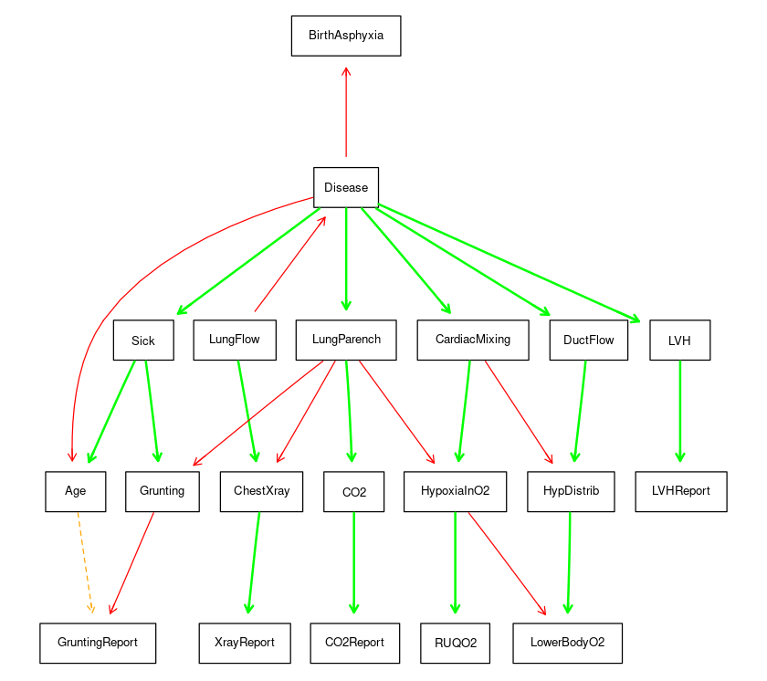

# Bayesian Networks
This project explores Bayesian Networks, focusing on the K2 algorithm and its implementation using the R library **BNstruct**.

Project for *Advanced Statistics for Physics Analysis*, University of Padua, A.Y. 2023/24<br>
Group members: [Paolo Lapo Cerni](https://github.com/paololapo), [Lorenzo Vigorelli](https://github.com/LorenzoVigorelli), [Arman Singh Bains](https://github.com/T3X3K) </br>

---
In this repository, you can find the summary of our research on these topics, organized into three main files:
* ```functions.R``` defines the pipelines for the K2 algorithm and the helper functions to study and manipulate the Bayesian Networks
* ```Analysis.ipynb``` is the notebook containing some comparisons of the performance of the algorithm and some usage of the BNstruct library
* ```BN_Presentation.pdf``` contains the slides of the oral presentation we gave to present our work. 


### Bayesian Networks
Bayesian Networks are probabilistic graphical models that represent a set of variables and their conditional dependencies via a directed acyclic graph (DAG). They are widely used for reasoning under uncertainty, where nodes represent variables, and edges depict the probabilistic dependencies between them.

<p align="center">

</p>

### K2 Algorithm
The K2 algorithm is a popular search-based method for learning the structure of Bayesian Networks from data. It incrementally constructs the network by adding parent nodes to each node, maximizing the likelihood of the observed data under the network structure. </br>
The scoring function has the following shape:
$$
f(i, \pi_i) = \displaystyle\prod_{j=1}^{q_i} \frac{(r_i-1)!}{(N_{ij}+r_i-1)!} \displaystyle\prod_{k=1}^{r_i} \alpha_{ijk}!  
$$
where 
* $\pi_i$ is the set of parentes of the node $x_i$.
* $q_i$ is number of all possible instantiations of the parents of $x_i$ in the data.
* $r_i$ is the number of all the possible values of the attribute $x_i$.
* $\alpha_{ijk}$ is the number of cases in the data in which $x_i$ is equal to its $k$-th value, and the parents in $\pi_i$ are equal to their $j$-th instantiation.
* $N_{ij}=\sum_k \alpha_{ijk}$ is the number of cases in the data in which the parents in $\pi_i$ are equal to their
$j$-th instantiation

The algorithm is efficient and works well with prior knowledge but requires a predefined node ordering.

### BNstruct Library
**BNstruct** is an R library designed for learning and inference in Bayesian Networks, particularly when dealing with incomplete and discrete data. It provides various tools to construct, manipulate, and analyze Bayesian Networks, making it an essential resource for researchers and practitioners working in the field. Have a look at the <a href="https://cran.r-project.org/web/packages/bnstruct/index.html"> official documentation</a>.